**[Name: Nishant Gupta]{.underline}**

**[Email: <ngofficial99@gmail.com>]{.underline}**

**[Industry: Healthcare]{.underline}**

**[Problem Statement:]{.underline}**

How to secure patient records online and send it privately to the
intended party Topics: In this project, you will be working on a
hospital project to send reports online and develop a platform so the
patients can access the reports via mobile and push notifications. You
will publish the report to an Amazon SNS keeping it secure and private.
Your message will be hosted on an EC2 instance within your Amazon VPC.
By publishing the messages privately, you can improve the message
delivery and receipt through Amazon SNS.

**[Highlights:]{.underline}**

1\. AWS CloudFormation to create a VPC

2\. Connect VPC with AWS SNS.

3\. Publish messages privately with SNS.

**[Task 1:]{.underline}**

-   We have to create keypair in EC2, Sign in to the AWS Management
    > Console and open the Amazon EC2 console.

-   find the Network & Security section. Then, choose Key Pairs.

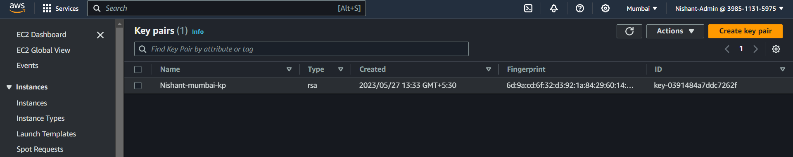{width="6.267716535433071in"
height="1.25in"}

-   Click on create key pair.

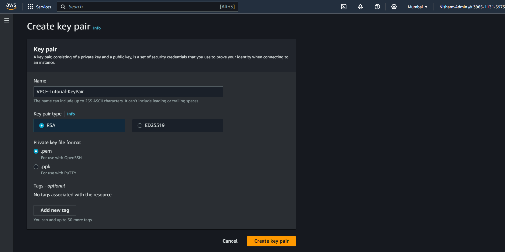{width="6.267716535433071in"
height="3.138888888888889in"}

-   Give the key pair with the name **VPCE-Tutorial-KeyPair** and then
    > click on create key pair.

-   Download and save the keypair.

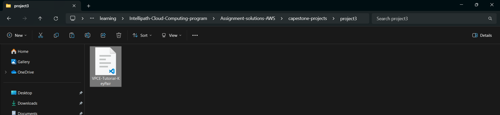{width="6.267716535433071in"
height="1.4444444444444444in"}

-   Now we have to create the resources in order to create the resources
    > we are going to make use of CloudFormation.

-   Go to cloudformation and click on create stack. We are going to use
    > the following template.

AWSTemplateFormatVersion: 2010-09-09

Description: CloudFormation Template for SNS VPC Endpoints Tutorial

Parameters:

KeyName:

Description: Name of an existing EC2 KeyPair to enable SSH access to the
instance

Type: \'AWS::EC2::KeyPair::KeyName\'

ConstraintDescription: must be the name of an existing EC2 KeyPair.

SSHLocation:

Description: The IP address range that can be used to SSH to the EC2
instance

Type: String

MinLength: \'9\'

MaxLength: \'18\'

Default: 0.0.0.0/0

AllowedPattern:
\'(\\d{1,3})\\.(\\d{1,3})\\.(\\d{1,3})\\.(\\d{1,3})/(\\d{1,2})\'

ConstraintDescription: must be a valid IP CIDR range of the form
x.x.x.x/x.

Mappings:

RegionMap:

us-east-1:

AMI: ami-428aa838

us-east-2:

AMI: ami-710e2414

us-west-1:

AMI: ami-4a787a2a

us-west-2:

AMI: ami-7f43f307

ap-northeast-1:

AMI: ami-c2680fa4

ap-northeast-2:

AMI: ami-3e04a450

ap-southeast-1:

AMI: ami-4f89f533

ap-southeast-2:

AMI: ami-38708c5a

ap-south-1:

AMI: ami-3b2f7954

ca-central-1:

AMI: ami-7549cc11

eu-central-1:

AMI: ami-1b2bb774

eu-west-1:

AMI: ami-db1688a2

eu-west-2:

AMI: ami-6d263d09

eu-west-3:

AMI: ami-5ce55321

sa-east-1:

AMI: ami-f1337e9d

Resources:

VPC:

Type: \'AWS::EC2::VPC\'

Properties:

CidrBlock: 10.0.0.0/16

EnableDnsSupport: \'true\'

EnableDnsHostnames: \'true\'

Tags:

\- Key: Name

Value: VPCE-Tutorial-VPC

Subnet:

Type: \'AWS::EC2::Subnet\'

Properties:

VpcId: !Ref VPC

CidrBlock: 10.0.0.0/24

Tags:

\- Key: Name

Value: VPCE-Tutorial-Subnet

InternetGateway:

Type: \'AWS::EC2::InternetGateway\'

Properties:

Tags:

\- Key: Name

Value: VPCE-Tutorial-InternetGateway

VPCGatewayAttachment:

Type: \'AWS::EC2::VPCGatewayAttachment\'

Properties:

VpcId: !Ref VPC

InternetGatewayId: !Ref InternetGateway

RouteTable:

Type: \'AWS::EC2::RouteTable\'

Properties:

VpcId: !Ref VPC

Tags:

\- Key: Name

Value: VPCE-Tutorial-RouteTable

SubnetRouteTableAssociation:

Type: \'AWS::EC2::SubnetRouteTableAssociation\'

Properties:

RouteTableId: !Ref RouteTable

SubnetId: !Ref Subnet

InternetGatewayRoute:

Type: \'AWS::EC2::Route\'

Properties:

RouteTableId: !Ref RouteTable

GatewayId: !Ref InternetGateway

DestinationCidrBlock: 0.0.0.0/0

SecurityGroup:

Type: \'AWS::EC2::SecurityGroup\'

Properties:

GroupName: Tutorial Security Group

GroupDescription: Security group for SNS VPC endpoint tutorial

VpcId: !Ref VPC

SecurityGroupIngress:

\- IpProtocol: \'-1\'

CidrIp: 10.0.0.0/16

\- IpProtocol: tcp

FromPort: \'22\'

ToPort: \'22\'

CidrIp: !Ref SSHLocation

SecurityGroupEgress:

\- IpProtocol: \'-1\'

CidrIp: 10.0.0.0/16

Tags:

\- Key: Name

Value: VPCE-Tutorial-SecurityGroup

EC2Instance:

Type: \'AWS::EC2::Instance\'

Properties:

KeyName: !Ref KeyName

InstanceType: t2.micro

ImageId: !FindInMap

\- RegionMap

\- !Ref \'AWS::Region\'

\- AMI

NetworkInterfaces:

\- AssociatePublicIpAddress: \'true\'

DeviceIndex: \'0\'

GroupSet:

\- !Ref SecurityGroup

SubnetId: !Ref Subnet

IamInstanceProfile: !Ref EC2InstanceProfile

Tags:

\- Key: Name

Value: VPCE-Tutorial-EC2Instance

EC2InstanceProfile:

Type: \'AWS::IAM::InstanceProfile\'

Properties:

Roles:

\- !Ref EC2InstanceRole

InstanceProfileName: EC2InstanceProfile

EC2InstanceRole:

Type: \'AWS::IAM::Role\'

Properties:

RoleName: VPCE-Tutorial-EC2InstanceRole

AssumeRolePolicyDocument:

Version: 2012-10-17

Statement:

\- Effect: Allow

Principal:

Service: ec2.amazonaws.com

Action: \'sts:AssumeRole\'

ManagedPolicyArns:

\- \'arn:aws:iam::aws:policy/AmazonSNSFullAccess\'

LambdaExecutionRole:

Type: \'AWS::IAM::Role\'

Properties:

AssumeRolePolicyDocument:

Version: 2012-10-17

Statement:

\- Effect: Allow

Principal:

Service: lambda.amazonaws.com

Action: \'sts:AssumeRole\'

ManagedPolicyArns:

\- \'arn:aws:iam::aws:policy/service-role/AWSLambdaBasicExecutionRole\'

LambdaFunction1:

Type: \'AWS::Lambda::Function\'

Properties:

Code:

ZipFile: \|

from \_\_future\_\_ import print_function

print(\'Loading function\')

def lambda_handler(event, context):

message = event\[\'Records\'\]\[0\]\[\'Sns\'\]\[\'Message\'\]

print(\"From SNS: \" + message)

return message

Description: SNS VPC endpoint tutorial lambda function 1

FunctionName: VPCE-Tutorial-Lambda-1

Handler: index.lambda_handler

Role: !GetAtt

\- LambdaExecutionRole

\- Arn

Runtime: python3.9

Timeout: \'3\'

LambdaPermission1:

Type: \'AWS::Lambda::Permission\'

Properties:

Action: \'lambda:InvokeFunction\'

FunctionName: !Ref LambdaFunction1

Principal: sns.amazonaws.com

SourceArn: !Ref SNSTopic

LambdaLogGroup1:

Type: \'AWS::Logs::LogGroup\'

Properties:

LogGroupName: !Sub \"/aws/lambda/\${LambdaFunction1}\"

RetentionInDays: \'7\'

LambdaFunction2:

Type: \'AWS::Lambda::Function\'

Properties:

Code:

ZipFile: \|

from \_\_future\_\_ import print_function

print(\'Loading function\')

def lambda_handler(event, context):

message = event\[\'Records\'\]\[0\]\[\'Sns\'\]\[\'Message\'\]

print(\"From SNS: \" + message)

return message

Description: SNS VPC endpoint tutorial lambda function 2

FunctionName: VPCE-Tutorial-Lambda-2

Handler: index.lambda_handler

Role: !GetAtt

\- LambdaExecutionRole

\- Arn

Runtime: python3.9

Timeout: \'3\'

LambdaPermission2:

Type: \'AWS::Lambda::Permission\'

Properties:

Action: \'lambda:InvokeFunction\'

FunctionName: !Ref LambdaFunction2

Principal: sns.amazonaws.com

SourceArn: !Ref SNSTopic

LambdaLogGroup2:

Type: \'AWS::Logs::LogGroup\'

Properties:

LogGroupName: !Sub \"/aws/lambda/\${LambdaFunction2}\"

RetentionInDays: \'7\'

SNSTopic:

Type: \'AWS::SNS::Topic\'

Properties:

DisplayName: VPCE-Tutorial-Topic

TopicName: VPCE-Tutorial-Topic

Subscription:

\- Endpoint: !GetAtt

\- LambdaFunction1

\- Arn

Protocol: lambda

\- Endpoint: !GetAtt

\- LambdaFunction2

\- Arn

Protocol: lambda

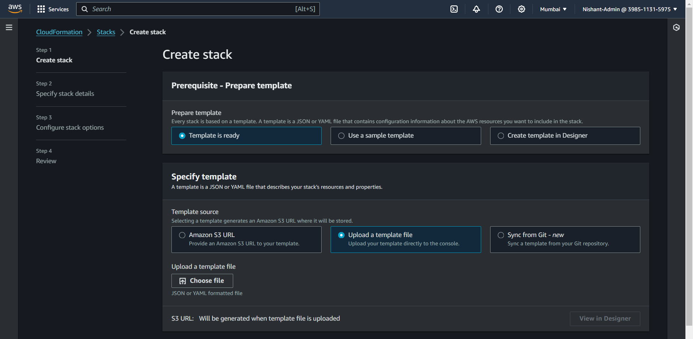{width="6.267716535433071in"
height="3.0694444444444446in"}

-   Upload the template and click on next.

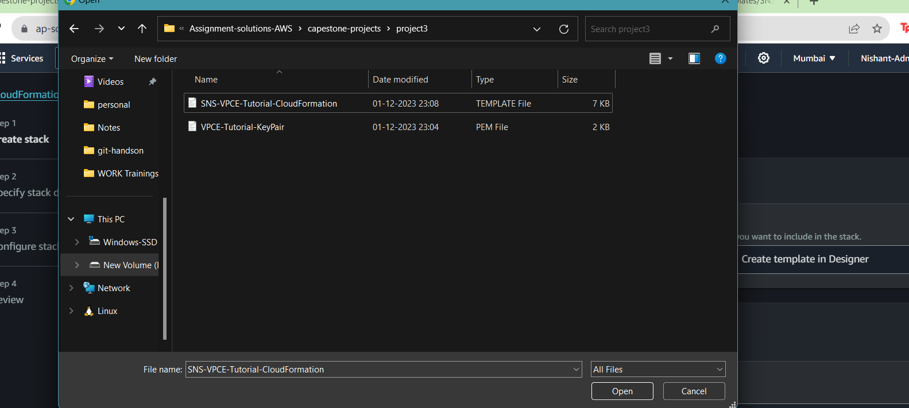{width="6.267716535433071in"
height="2.8194444444444446in"}

-   Provide the stack a name and Key Pair name, then click next.

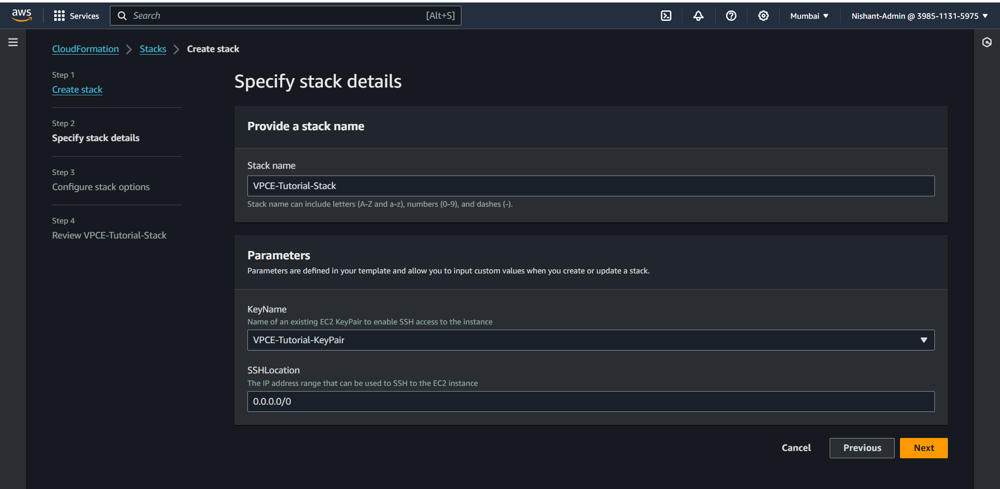{width="6.267716535433071in"
height="3.0694444444444446in"}

-   Provide an Iam role with poweruser permissions.

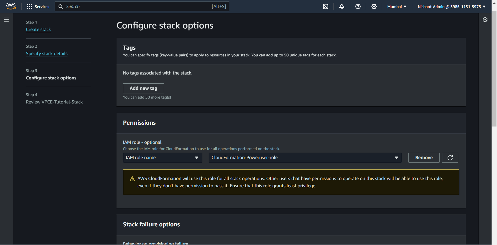{width="6.267716535433071in"
height="3.0972222222222223in"}

-   Click on next and then review and click on create stack.

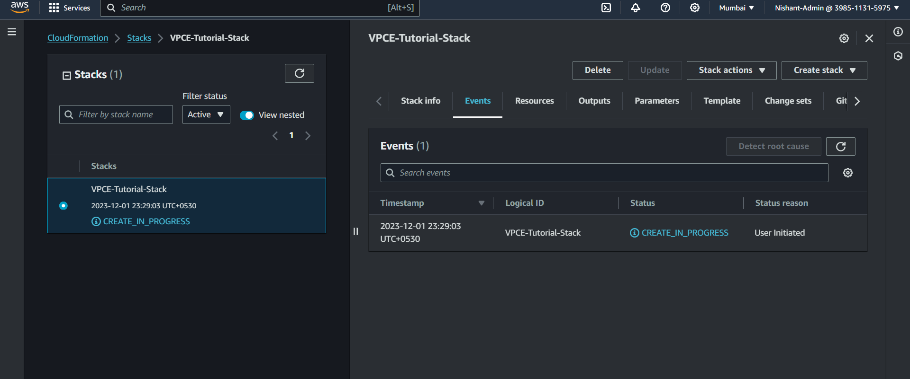{width="6.267716535433071in"
height="2.611111111111111in"}

-   Wait for the stack to be created.

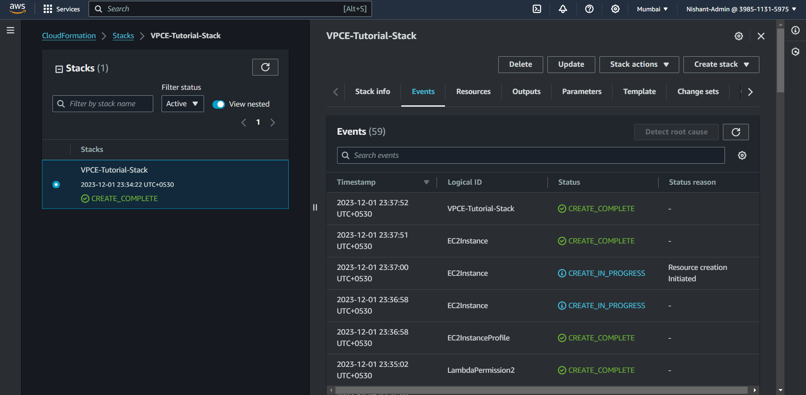{width="6.267716535433071in"
height="3.0694444444444446in"}

-   Now that we have all the necessary resources created we will create
    > a VPC endpoint so that we can send the message.

-   Open VPC.

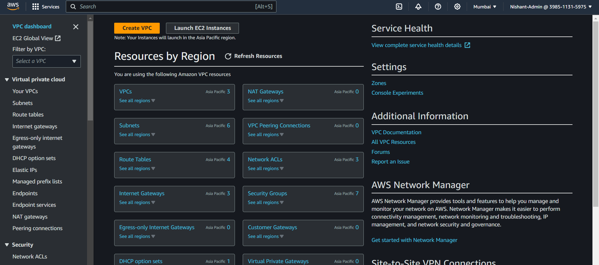{width="6.267716535433071in"
height="2.7777777777777777in"}

-   On the left hand side we will select Endpoints.

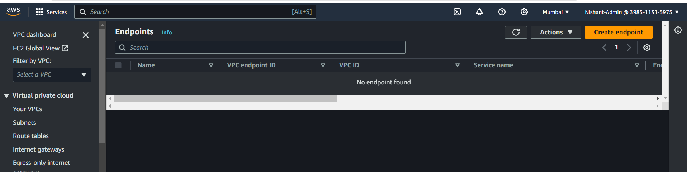{width="6.267716535433071in"
height="1.5694444444444444in"}

-   Click on create endpoint.

-   Select the SNS service and select our VPC.

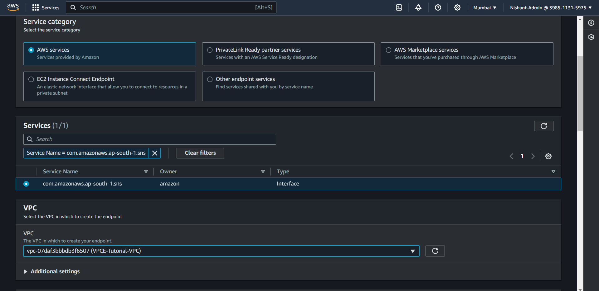{width="6.267716535433071in"
height="3.0555555555555554in"}

-   Select the private subnet and select the project security group.

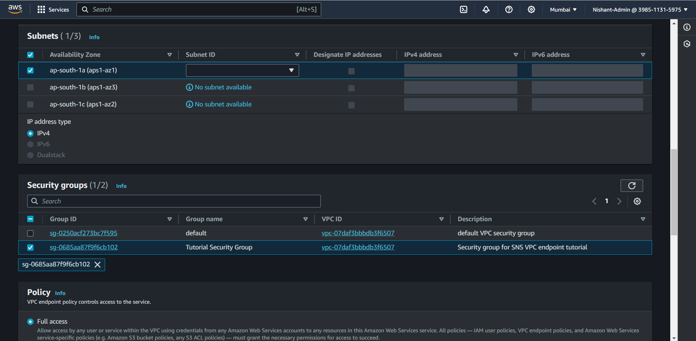{width="6.267716535433071in"
height="3.0694444444444446in"}

-   Click on create ENDPOINT.

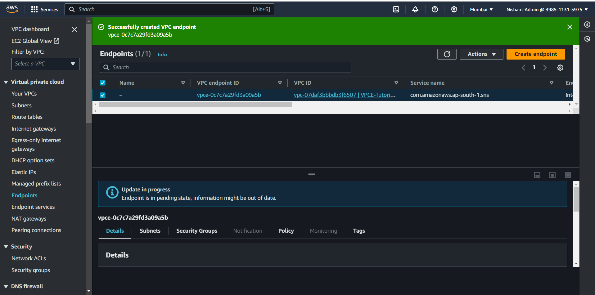{width="6.267716535433071in"
height="3.111111111111111in"}

-   Now we will publish the message to the SNS topic to do that we will
    > first ssh into the ec2 instance.

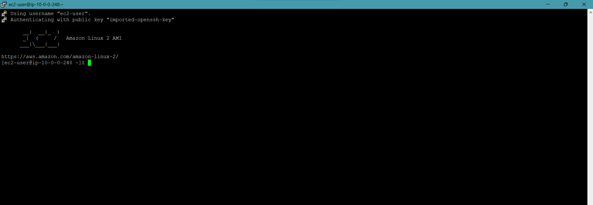{width="6.267716535433071in"
height="2.1805555555555554in"}

-   Now we will try to send SNS message from the EC2 instance.

-   We have to use this instance.

aws sns publish \--region ap-south-1 \--topic-arn
arn:aws:sns:ap-south-1:398511315975:VPCE-Tutorial-Topic \--message
\"Hello\"

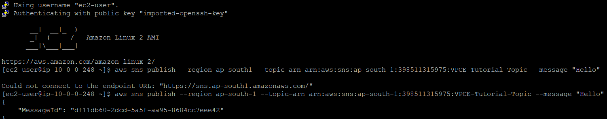{width="6.267716535433071in"
height="1.2361111111111112in"}

-   Once we have sent the message we can check the and verify if the
    > message has been delivered.

-   Open the AWS Lambda console at
    > <https://console.aws.amazon.com/lambda/>.

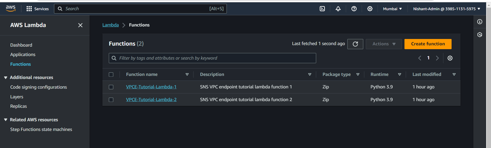{width="6.267716535433071in"
height="1.9027777777777777in"}

-   On the Functions page, choose VPCE-Tutorial-Lambda-1.

-   Choose Monitoring.

-   Check the Invocation count graph. This graph shows the number of
    > times that the Lambda function has been run.\
    > The invocation count matches the number of times you published a
    > message to the topic.

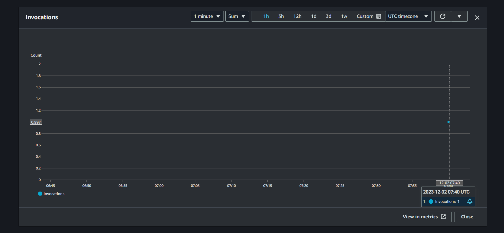{width="6.267716535433071in"
height="2.9027777777777777in"}

-   Our message has successfully invoked the graph once, that means we
    > have received the SNS message successfully.
